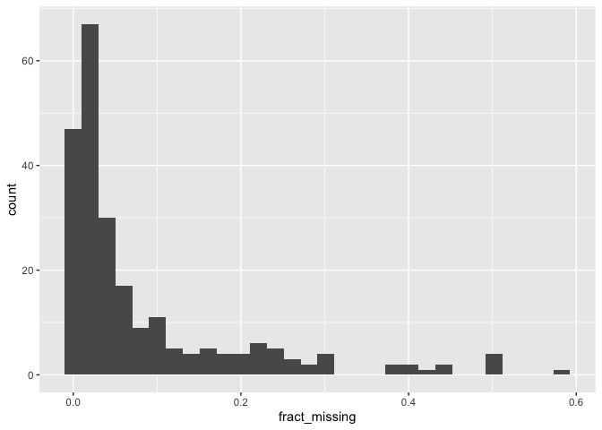
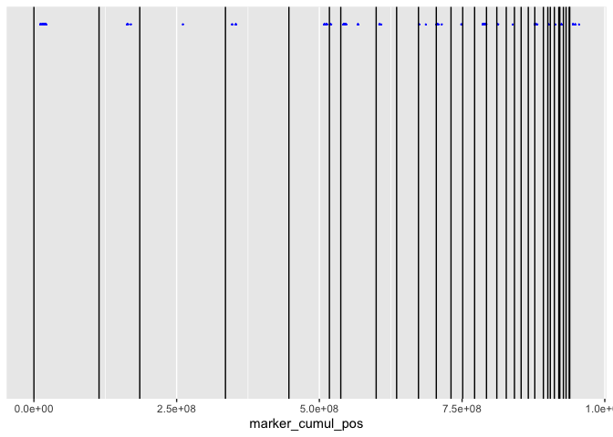
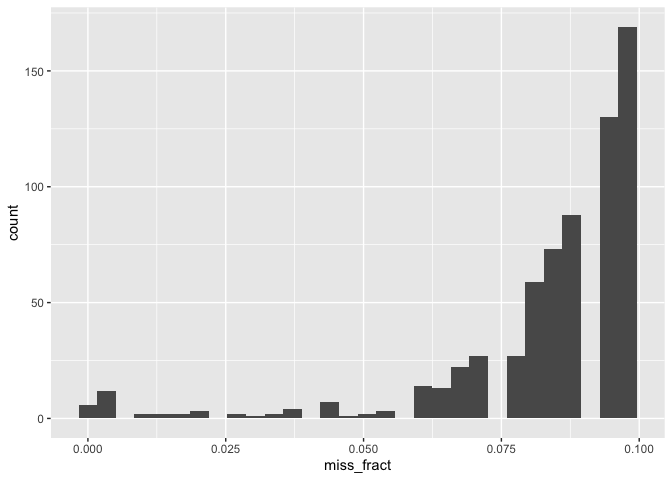
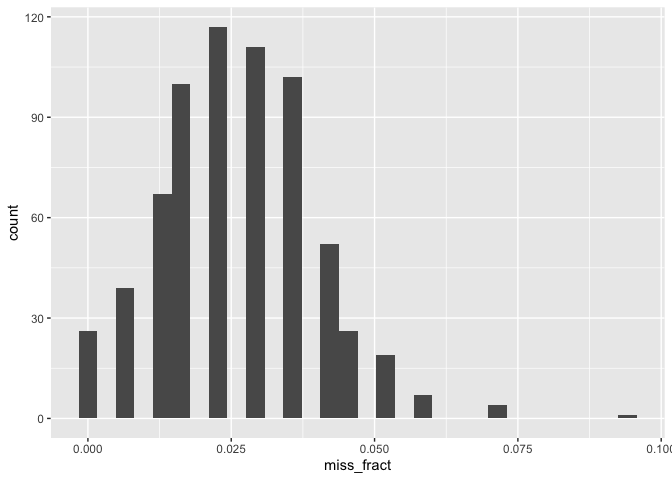

Hands On Session With NewHybrids
================

## Working Directory

I want everyone to do this work in a directory on your computer. You can
put that wherever is appropriate for your file system. When you are
running R, that directory should be your working directory. When you are
running things on the command line, your working directory should be
that directory. I will refer to it as “your working directory.”

## Make You have the data

Marina has posted four data files of Canvas. You should download those
files and put them inside a directory called `data` in your working
directory.

## Getting NewHybrids

We are going to be making heavy use of the data visualization
capabilities in newhybrids. These are reliable only on Macs. So, if you
have a PC (or if you are not super comfortable on the Unix command line)
partner up with someone who has a Mac (and is maybe more comfortable on
the Unix command line).

You are going to download newhybrids by navigating to the page on GitHub
that has the executable:

<https://github.com/eriqande/newhybrids/blob/master/bin/OSX/newhybs>

and clicking the download button. (Picture on PowerPoint).

1.  Once it is downloaded move it to your working directory.  
2.  Then navigate to your working directory on the Unix command line
    (i.e., using Terminal or iTerm on your Mac)
3.  Make it executable by doing this Unix command:

``` sh
chmod u+x newhybs
```

4.  Then try running it to get the help information:

``` sh
./newhybs --help
```

At this juncture, your Mac will scream at you because this software did
not come from a “trusted” source. So:

1.  Click Cancel
2.  Go to Apple Menu -\> System Settings…
3.  Type `security` in the searchbox and click on `Security Settings`
4.  Where it tells you newhybs was blocked, click `Allow Anyway` and
    enter your administrator credentials.

Now go back to the unix command line and type:

    ./newhybs --help

once more. This time you probably have to convince your Mac one more
time that you really want to do this. It will pop up a notice that the
developer cannot be verified. Simply click, “Open”, and then you should
be good to go.

## Let’s Investigate the Data

Johanna provided the data in “Variant Call Format.” This is a standard
format for genotypes derived from sequencing data. If you have never
looked at a VCF file before, it is worth doing. We can do that on the
Unix/Linux terminal like this:

``` sh
gzip -cd  data/HZ_ybch_diff95.vcf.gz  | less -S
```

You can get out of the `less` viewer by hitting the `q` key.

We can talk about this format—it can be daunting at first.

## Let us write some tools to get the data into NewHybrids format

There are a number of wonderful tools for manipulating VCF files on the
Unix command line (like `bcftools`); however, we can also use R, with
the package ‘vcfR’ to manipulate the data into shape for NewHybrids.
People here are probably more familiar with R that with bcftools, so we
will use R.

For a quick heads up on where we are going, we want to get the data into
the format that NewHybrids uses, which is described in [the newhybrids
manual](https://github.com/eriqande/newhybrids/blob/master/new_hybs_doc1_1Beta3.pdf),
and which looks like this:

    NumIndivs 79 
    NumLoci 49
    Digits 1
    Format Lumped

    LocusNames  sAAT1 sAAT2 sAAT3 ADA1 ADA2 ADH mAH1 mAH3 sAH mAAT1 CKA1 CKB FH
                bGLUA bGALA GDA2 G3PDH1 GPIB2 GPIA GR mIDHP1 mIDHP2 sIDHP2 LDHA1 LDHA2 LDHB1
                LDHB2 LDHC PEPB1 PEPLT sMDHA1 sMDHA2 sMDHB1 sMDHB2 sMEP2 mMEP1 MPI NTP PGDH
                PGK1 PGK2 PGM2 PEPD1 IDDH1 sSOD1 TPI1 TPI2 TPI4 TPI3

    1   11  11  11  0  11  11  11  11  11  11  11  11  11  32  11  11  21  11  11  11  11 
                 11  21  11  11  13  11  11  11  21  11  11  11  11  11  11  11  11  11  11  11 
                 11  11  11  11  11  11  11  11 
    2   21  11  21  11  11  12  11  11  12  11  11  11  0  11  11  11  12  11  12  11  11 
                 11  11  11  11  11  12  11  11  22  11  11  11  11  11  11  11  11  11  11  11 
                 11  11  11  11  11  11  11  11 
    3   11  11  21  12  11  21  11  11  11  11  11  11  11  22  11  11  31  11  11  11  11 
                 11  11  11  11  33  22  11  11  21  11  11  11  11  11  11  11  11  11  11  11 

So, we will get the data in an R data frame (a tidy tibble!) which we
can manipulate how we want and then we will have a function to punch out
the data set in the above format.

Notice that missing data is denoted by a 0.

### Get the data into a tidy tibble

So, we will get all the data a format that has columns: `chrom`, `pos`,
`indiv`, `geno`, where the `geno` column is 11 for `0/0` (i.e. the
reference homozygote), 22 for `1/1`, and either 12 or 21 for `0/1`, or
`1/0`, respectively. And 0 for a missing genotype.

Here is a function that does that

``` r
library(tidyverse)
library(vcfR)

#' Read a VCF file into a long-format tibble that will be easy to make into a newhybrids input
#' @param vcf_path the path to the VCF file
vcf2nh_tidy <- function(vcf_path) {
  v <- read.vcfR(vcf_path, verbose = FALSE)
  vt <- vcfR2tidy(v)
  ck <- vt$fix %>%
    distinct(ChromKey, CHROM)
  vt$gt %>%
    left_join(ck, by = join_by(ChromKey)) %>%
    rename(chrom = CHROM, pos = POS, indiv = Indiv, gt = gt_GT) %>%
    select(chrom, pos, indiv, gt) %>%
    mutate(
      geno = case_when(
        is.na(gt) ~ "0",
        gt == "0/0" ~ "11",
        gt == "1/1" ~ "22",
        gt == "0/1" | gt == "1/0" ~ "12",
        TRUE ~ "PROBLEM!!"
      )
    ) %>%
    select(-gt)
}
```

And we can use it to read in the two data sets that Johanna has: the HZ
one, which is focused on the hybrid zone birds, and the “all” one which
has them all.

``` r
all_long <- vcf2nh_tidy("data/all_ybch_diff85.vcf.gz")
hz_long <- vcf2nh_tidy("data/HZ_ybch_diff95.vcf.gz")
```

### Look over these samples and order them appropriately

We have individual sample names in these that look like:

``` r
unique(all_long$indiv) %>% head()
```

    ## [1] "Y_96N0042_CKDL240031457-1A_22GH2JLT4_L6"
    ## [2] "Y_96N0238_CKDL240031457-1A_22GH2JLT4_L6"
    ## [3] "Y_96N0349_CKDL240031457-1A_22GH2JLT4_L6"
    ## [4] "Y_97N5522_CKDL240031457-1A_22GH2JLT4_L6"
    ## [5] "Y_98N3098_CKDL240031457-1A_22GH2JLT4_L6"
    ## [6] "Y_98N3156_CKDL240031457-1A_22GH2JLT4_L6"

and

``` r
unique(hz_long$indiv) %>% head()
```

    ## [1] "YBCH1_23E29J01_S1" "YBCH3_23F01J01_S2" "YBCH5_23F01A02_S3"
    ## [4] "YBCH6_23F02A01_S4" "YBCH7_23F02J01_S5" "YBCH8_23F02J02_S6"

In order to view the results in an intuitive way, it will be nice to
arrange these birds in an order where all the putatively pure birds are
together and the putative hybrids are also near one another in the data
set. We can learn which birds are which from the “popmap” files for each
of them. These files look like:

###### popmap_allybch.csv

``` r
popmap_all <- read_csv("data/popmap_allybch.csv")
popmap_all
```

    ## # A tibble: 235 × 10
    ##    BGP_ID    Lat   Long State color   Population sample    pop      pop2    pop1
    ##    <chr>   <dbl>  <dbl> <chr> <chr>   <chr>      <chr>     <chr>   <dbl>   <dbl>
    ##  1 96N0042  41.1 -122.  CA    #004488 western    Y_96N004… p2    1.00e+0 1.01e-4
    ##  2 96N0238  36.3 -122.  CA    #004488 western    Y_96N023… p2    1.00e+0 1.02e-4
    ##  3 96N0349  40.9 -110.  UT    #004488 western    Y_96N034… p2    9.96e-1 4.41e-3
    ##  4 97N5522  40.8 -124.  CA    #004488 western    Y_97N552… p2    1.00e+0 1.01e-4
    ##  5 98N3098  42.3  -75.8 NY    #5aae61 eastern    Y_98N309… p1    1.01e-4 1.00e+0
    ##  6 98N3156  32.8  -80.0 SC    #5aae61 eastern    Y_98N315… p1    1.01e-4 1.00e+0
    ##  7 98N3248  42.6 -109.  WY    #004488 western    Y_98N324… p2    1.00e+0 1.02e-4
    ##  8 98N5070  39.0  -96.8 KS    #5aae61 eastern    Y_98N507… p1    1.00e-4 1.00e+0
    ##  9 98N5244  39.3  -94.9 KS    #5aae61 eastern    Y_98N524… p1    4.55e-2 9.54e-1
    ## 10 99N0449  42.5 -121.  OR    #004488 western    Y_99N044… p2    1.00e+0 1.02e-4
    ## # ℹ 225 more rows

###### popmap_hz.csv

``` r
popmap_hz <- read_csv("data/popmap_hz.csv")
popmap_hz
```

    ## # A tibble: 93 × 10
    ##    BGP_ID   Lat  Long State Color   Missingness_16milSNPs  pop1     pop2 sample 
    ##    <chr>  <dbl> <dbl> <chr> <chr>                   <dbl> <dbl>    <dbl> <chr>  
    ##  1 YBCH1   30.3 -97.6 TX    #5aae61               0.0179  1.00  0.0001   YBCH1_…
    ##  2 YBCH3   30.5 -95.6 TX    #5aae61               0.0283  0.966 0.0337   YBCH3_…
    ##  3 YBCH5   30.5 -95.6 TX    #5aae61               0.0845  0.971 0.0290   YBCH5_…
    ##  4 YBCH6   30.6 -95.6 TX    #5aae61               0.0625  1.00  0.000100 YBCH6_…
    ##  5 YBCH7   30.5 -95.7 TX    #5aae61               0.0823  0.895 0.105    YBCH7_…
    ##  6 YBCH8   30.6 -95.6 TX    #5aae61               0.0578  0.940 0.0597   YBCH8_…
    ##  7 YBCH11  34.1 -94.6 OK    #5aae61               0.0496  0.971 0.0292   YBCH11…
    ##  8 YBCH12  34.1 -94.6 OK    #5aae61               0.0202  0.965 0.0354   YBCH12…
    ##  9 YBCH14  34.5 -95.3 OK    #5aae61               0.0280  0.973 0.0273   YBCH14…
    ## 10 YBCH15  34.5 -95.4 OK    #5aae61               0.00641 1.00  0.000100 YBCH15…
    ## # ℹ 83 more rows
    ## # ℹ 1 more variable: pop <chr>

It appears that the `sample` column in both cases gives the sample names
that are used in the VCF files.

### A function to write the NewHybrids file

We now have the ingredients we need to write samples to a NewHybrids
file, sorted in a way that makes sense. One of the silly things about
NewHybrids is that the input file takes a sample number (in order from
1, 2, 3,…), rather than a sample name, so we will also want to write out
a file that gives the index/number that corresponds to each sample.

Let’s write a function to do this, so that we can use it over again, as
needed.

``` r
#' Write out a newhybrids file
#' 
#' @param ordered_samples  a tibble with a column `sample` that are in the order
#' you want individuals to appear in the newhybrids file. Note that if you want to
#' remove individuals, you just make sure they do not appear in `ordered_samples`
#' @param nh_tidy a tibble that is like the output of `vcf2nh_tidy()`.  All samples
#' requested in `ordered_samples` must appear in the `indiv` column.  If there is a
#' column `ZS` in nh_tidy, then its contents will for the z and s options string for
#' each row.
#' @param outpath  the path to the newhybrids output file to write.  New directories will
#' be created as needed and the file giving index/number corresonding to each
#' sample will be written out as `outpath + _sample_index`.
#' @output This is called for its side effect of writing two files that can be
#' used in NewHybrids.
write_nh <- function(ordered_samples, nh_tidy, outpath) {
  levs <- ordered_samples$sample
  
  if("ZS" %in% names(ordered_samples)) {
    os <- ordered_samples %>%
      select(sample, ZS)
  } else {
    os = ordered_samples %>%
      select(sample)
  }
  wide <- os %>%
    inner_join(nh_tidy, by = join_by(sample == indiv)) %>%  # use inner join to drop birds that were chucked due to missing data...
    mutate(
      chrompos = str_c(chrom, ":", pos)
    ) %>%
    select(-chrom, -pos) %>%
    pivot_wider(
      names_from = chrompos,
      values_from = geno
    ) %>%
    mutate(idx = 1:n(), .before = sample)
  
  # write that out
  dn <- dirname(outpath)
  if(dn != ".") {
    dir.create(dn, showWarnings = FALSE, recursive = TRUE)
  }
  outNH <- outpath
  outIDX <- str_c(outpath, "_sample_index")
  
  Locus_vec <- names(wide) %>%
    setdiff(c("idx", "ZS", "sample"))
  
  # put the preamble/header stuff in the file
  cat(
    "NumIndivs ", nrow(wide),
    "\nNumLoci ", length(Locus_vec),
    "\nDigits 1\nFormat Lumped",
    "\n\n",
    "LocusNames ", paste(Locus_vec, sep = " ", collapse = " "),
    "\n\n",
    file = outNH,
    sep = ""
  )
  
  # write the data themselves
  wide %>%
    select(-sample) %>%
    write_tsv(outNH, col_names = FALSE, append = TRUE)
  
  # then write the indices
  wide %>%
    select(idx, sample) %>%
    write_tsv(file = outIDX)
}
```

## Running NewHybrids

Now we can make input files for NewHybrids and run it.

### No “prior” information

First, we throw all the individuals into the analysis without giving
newhybrids any hints about who is “pure” and who is from from the hybrid
zone, etc.

We will make each data set in its own directory. These are “vanilla”
runs because we are not using any information about pure and likely
hybrid birds. We will focus on the data set with “all” the birds, but we
can make the other.

``` r
popmap_all %>%
  arrange(desc(pop1)) %>%
  write_nh(all_long, "results/all/vanilla/dat.txt")

popmap_hz %>%
  arrange(desc(pop1)) %>%
  write_nh(all_long, "results/hz/vanilla/dat.txt")
```

And now we can run those. From the working directory on the Unix
terminal we will change directories into `results/all/vanilla` and tell
it to run newhybs on the data set.

``` sh
cd results/all/vanilla/
../../../newhybs -d dat.txt
```

When that starts, it launches the “Info” window. If the predefined views
have been installed correctly, then hitting the `1` key should open a
lot of other windows.

A few useful gfmcmc commands:

- `Space Bar`: Start or stop the MCMC simulation
- `/`: make the current window full size (or return to its original
  size)
- `S`: start the MCMC again from a random starting point
- `E`: restart the running averages from the current state
- `X`: close all windows except the info window (helps to make things
  run faster)
- `W`: close the selected window
- `Drag-Box Zoom`: shift-click and drag a white box. Hit `z` to zoom to
  it. Hit `v` to zoom back out to default fit.

With many loci and not many samples, NewHybrids does not necessarily
converge to the right part of the space. Sometimes nearly everyone is
inferred to be an F2! Looking at the data, there is clear structure,
it’s just that the MCMC doesn’t get there.

### Pre-assign birds to different pure categories based on structure results

By giving NewHybrids a few hints about who is an eastern and who is a
western bird, the Markov chain converges quite quickly to a reasonable
looking part of the space. This is done by setting the Z option for each
individual.

We can set the Z for individuals with an admixture fraction \>0.999 or
less than \<0.0002, and see what happens then.

``` r
popmap_all %>%
  arrange(desc(pop1)) %>%
  mutate(
    ZS = case_when(
      pop1 > 0.999 ~ "z0",
      pop1 < 0.0002 ~ "z1",
      TRUE ~ ""
    )
  ) %>%
  write_nh(all_long, "results/all/a_few_Zs/dat.txt")
```

Then run change to that directory and run newhybs there.

#### What do we find?

- The alleles get separated into two different groups along the lines of
  the two groups of birds
- However, there are a lot of Backcrosses in the red group.
- Instability across runs. I had one run that made it pretty clear that
  some individuals looked like candidates for being contaminated. They
  were:

``` r
contam_suspects <- c(20, 23, 24, 39)
```

They had a lot of missing data, too.

## What is going on here?

Two possibilities are:

1.  Birds with a lot of missing data are messing things up.
2.  The NewHybrids assumption that markers are not physically linked
    might be causing problems.

### Exploring Missing Data

Let’s look at the amount of missing data in the `all` data set.

``` r
miss_fracts_all <- all_long %>%
  group_by(indiv) %>%
  summarise(fract_missing = mean(geno == "0"))

ggplot(miss_fracts_all, aes(x = fract_missing)) +
  geom_histogram()
```

    ## `stat_bin()` using `bins = 30`. Pick better value with `binwidth`.

<!-- -->

OK, there are some birds with a lot of missing loci. Apparently this was
from lcWGS. I don’t know how the calls were made. Not by beagle
imputation. But at any rate, a lower call rate means low coverage in
those birds, so genotype calls are less reliable in those birds and they
are also more prone to effects from contamination.

I propose dropping samples with \>=9% missing loci. Let’s do that and
re-run NewHybrids.

``` r
all_lt9perc_missing <- all_long %>%
  group_by(indiv) %>%
  filter(mean(geno == "0") < 0.09)

popmap_all %>%
  arrange(desc(pop1)) %>%
  mutate(
    ZS = case_when(
      pop1 > 0.999 ~ "z0",
      pop1 < 0.0002 ~ "z1",
      TRUE ~ ""
    )
  ) %>%
  write_nh(all_lt9perc_missing, "results/all/lt9p_missing_someZs/dat.txt")
```

Then we run it.

When I ran it before I found two interesting things:

1.  Looking at the raw data, it is clear that the markers are not fixed.
2.  There might be clusters of markers that are not independent (likely)
3.  The Average origins of alleles make it clear that NewHybrids is
    willing to call pure birds pure birds, but the hybrids clearly have
    something different going on, but newhybrids can’t pull them apart
    as hybrids. There are a couple of possibilities for why that may be:
    - The inclusion of so many pure individuals (that are outside of the
      hybrid zone) have articially lowered the mixing proportion of
      hybrids.
    - With so many markers (many of which are likely linked) the
      posterior probabilities don’t reflect uncertainty well and it is
      easy for the sampler to get caught in a wrong part of the space,
      and yet not reflect the uncertainty that is really there.

It is interesting to ponder that if you throw a lot of markers into
NewHybrids and tell it they are all unlinked, it might behave badly.

### Exploring the markers

In looking at the data, it appeared that the markers (which were chosen
to have large allele frequency differences between east and west) were
clustered in only a few spots in the genome. We can make a map of where
those markers are relative to the chromosomes.

The VCF file carries around information about the genome, including the
lengths of the chromosomes. So, let’s extract that info:

``` r
VCF_lines <- read_lines("data/all_ybch_diff85.vcf.gz")
contigs <- tibble(
  line = VCF_lines
) %>%
  filter(str_detect(line, "^##contig="))

# there are 2110 such contigs.  Most of them are unmapped scaffolds.
# let us just keep the chromosomes.
chromos <- contigs %>%
  filter(str_detect(line, "=chr"))
```

That has given us 31 chromosomes, and now we just need to extract their
names and their lengths. While we are at it, we will calculate the
starting base pair cumulatively from the beginning of the genome, for
each locus.

``` r
chrom_lengths <- chromos %>%
  extract(
    line,
    into = c("chrom", "length"),
    regex = "^##contig=<ID=(.+),length=(.+)>$",
    convert = TRUE
  ) %>% 
  mutate(
    cumul_start = lag(cumsum(length), default = 0L) + 1,
    cumul_mid = cumul_start + length / 2
  )
```

Now, get the chromosomes and the positions of all the markers, and then
compute their cumulative position in the genome.

``` r
marker_cumul <- all_long %>%
  distinct(chrom, pos) %>%
  left_join(chrom_lengths, by = join_by(chrom)) %>%
  mutate(marker_cumul_pos = cumul_start + pos)
```

Now we can plot the positions of the markers relative to the chromosome
ends:

``` r
ggplot() +
  geom_point(data = marker_cumul, aes(x = marker_cumul_pos), y = 1, colour = "blue", size = 0.1) +
  geom_vline(data = chrom_lengths, aes(xintercept = cumul_start))
```

    ## Warning: Removed 30 rows containing missing values or values outside the scale range
    ## (`geom_point()`).

<!-- -->
The black lines are the endpoints of chromosomes. The blue dots are
positions of the markers.

So, the markers are certainly clustered by chromosome. It looks like
there might be about 18 chromosomes or so, that the markers fall on.

In order to have a data set that we knew fit the newhybrids model, we
would have just a single markers per chromosome. Let’s do that by taking
the marker from each chromosome that has the least amount of missing
data.

First calculate the fraction of missing data across loci:

``` r
locus_miss_fracts <- all_long %>%
  group_by(chrom, pos) %>%
  summarise(miss_fract = mean(geno == "0")) %>%
  ungroup() %>%
  arrange()
```

    ## `summarise()` has grouped output by 'chrom'. You can override using the
    ## `.groups` argument.

``` r
# let's look at that
ggplot(locus_miss_fracts, aes(x = miss_fract)) +
  geom_histogram()
```

    ## `stat_bin()` using `bins = 30`. Pick better value with `binwidth`.

<!-- -->

So, that is an interesting pattern. Let’s redo that count and only count
in birds that have less than 9% missing data.

``` r
locus_miss_fract_clean <- all_long %>%
  group_by(indiv) %>%
  filter(mean(geno == "0") < 0.09) %>%
  group_by(chrom, pos) %>%
  summarise(miss_fract = mean(geno == "0")) %>%
  ungroup()
```

    ## `summarise()` has grouped output by 'chrom'. You can override using the
    ## `.groups` argument.

``` r
ggplot(locus_miss_fract_clean, aes(x = miss_fract)) +
  geom_histogram()
```

    ## `stat_bin()` using `bins = 30`. Pick better value with `binwidth`.

<!-- -->

That looks much more reasonable. Now, let’s take let’s filter out
individuals and take the locus with the least missing data on each
chromosome. But let us also choose that locus from amongst the ones in
hz_all, because those had larger inferred allele frequency differences
between the two different populations of birds.

``` r
locus_miss_fract_clean_hz <- locus_miss_fract_clean %>%
  semi_join(hz_long, by = join_by(chrom, pos))
```

That is weird. There is not much overlap there. Perhaps the allele
frequencies were estimated with structure and they vary quite a lot from
run to run.

So, just use the all loci:

``` r
lo_missing_26_loci <- locus_miss_fract_clean %>%
  arrange(chrom, miss_fract) %>%
  group_by(chrom) %>%
  slice(1)
lo_missing_26_loci
```

    ## # A tibble: 26 × 3
    ## # Groups:   chrom [26]
    ##    chrom      pos miss_fract
    ##    <chr>    <int>      <dbl>
    ##  1 chr1  15632404     0     
    ##  2 chr10 18152966     0.0118
    ##  3 chr12 16780472     0     
    ##  4 chr14  1987502     0.0235
    ##  5 chr15 11400841     0.0294
    ##  6 chr1a 49039352     0.0118
    ##  7 chr2  75550640     0.0941
    ##  8 chr20   263703     0     
    ##  9 chr22  1875902     0.0353
    ## 10 chr24  1698231     0.0294
    ## # ℹ 16 more rows

Now, ditch the messy individuals and keep only those 26 loci (one per
chromosome).

``` r
loci26 <- all_long %>%
  group_by(indiv) %>%
  filter(mean(geno == "0") < 0.09) %>%
  ungroup() %>%
  semi_join(lo_missing_26_loci, by = join_by(chrom, pos))
```

Then make some new data sets from that.

First do one with no training data.

``` r
popmap_all %>%
  arrange(desc(pop1)) %>%
  write_nh(loci26, "results/all/26loci/dat.txt")
```

And run it in newhybs. That goes a lot faster….

OK! When we run that in newhybs we see that sometimes the MCMC does not
converge to a good part of the space, but by doing multiple random
restarts (`S` key) we sometimes find that it converges to a state that
makes sense.

With those markers, one ends up with some evidence of F2s and
backcrosses in one direction amongst the hybrid birds. Keeping in mind
that F2 is a catch-all category of “bird that with ancestry that
involves backcrossing in both directions.”

**DISCUSSION TOPIC**: What is this telling us about putting big blocks
of linked markers into analyses that expect/assume unlinked markers?

### Rerun that while estimating mixing proportions only for the hybrid zone birds

There are 5 birds in the data set that are from the hybrid zone. They
all look to be non-pure birds. But the way we ran the last run,
newhybrids is calculating the mixing proportions (of genotype
categories) using all the birds in the data set. Because there are so
many birds from outside the hybrid zone, that are known to be pure-ish,
this is going to make the program expect *a priori* that most the birds
in the hybrid zone will be pure, too. This is probably not warranted.

Instead, we can tell the program to estimate the mixing proportions just
from the 5 hybrid zone individuals. We can do that like this by adding
the `s` flag to the birds that should not be used to estimate the
category frequencies. But, when we do this, we should also tell the
program which population they belong to…otherwise they might be
estimated to be hybrids, because they are not included in estimation of
the mixing proportions. Note that the hybrid zone birds are labeled `f1`
in the `pop` column of the popmap.

``` r
popmap_ZS <- popmap_all %>%
  arrange(desc(pop1)) %>%
  mutate(
    ZS = case_when(
      pop == "p1" ~ "z0s", # z0 = call if from population 0. s = don't use it to calculate mixing proportions
      pop == "f1" ~ "",
      pop == "p2" ~ "z1s",
      TRUE ~ "PROBLEM"
    )
  ) 

write_nh(popmap_ZS, loci26, "results/all/26loci_zs_options/dat.txt")
```

That is cool. It is showing us that the “pure” birds, under this
scenario where they are not used to estimate the mixing proprtions,
would have a high posterior mean of being pure, but it jumps around. Not
a worry—their alleles all get divvied up according’ to where they are
said to be from via the z option.

Another thing we could do is just fix the mixing proportions so that any
bird is equally likely to be Pure0, Pure1, F1, F2, BX_0, or BX_1. Then
we will effectively be getting the likelihood of each bird belonging to
any of the categories, given their genetic data. We do that like this:

``` sh
# in: results/all/26loci_zs_options
 ../../../newhybs -d dat.txt  \
    -g Pure0 1.0  0.0  0.0 \
    -g Pure1 0.0  0.0  1.0 \
    -g F1    0.0  1.0  0.0 \
    -g F2    0.25 0.5 0.25 \
    -g BX0   0.5  0.5  0.0 \
    -g BX1   0.0  0.5  0.5 \
    --pi-prior fixed  1 1 1 1 1 1
```

and you can read the output of `newhybs --help-full` to see why.

That makes quite a bit of sense. Though it would be worth doing that
multiple times over, sampling a single locus from each chromosome and
looking at the results.

## Multiple samplings of a single locus from each chromosome

We can write a quick function to make resampled data sets where we are
drawing a single locus from each chromosome. We will name the output
files according to the random number seed used.

``` r
sample_one_SNP_per_chromosome <- function(popmap = popmap_ZS, nh_tidy = all_long, seed) {
  # filter down to no more than 9% missing data amongst indivs
  no_losers <- nh_tidy %>%
    group_by(indiv) %>%
    filter(mean(geno == "0") < 0.09) %>%
    ungroup()
  
  # then, get a list of loci
  loci <- no_losers %>%
    distinct(chrom, pos)
  
  # sample one locus per chromsome
  set.seed(seed)
  selected_loci <- loci %>%
    group_by(chrom) %>%
    slice_sample(n = 1)
  
  # get the data set limited to only those loci
  nh_slim <- no_losers %>%
    semi_join(selected_loci, by = join_by(chrom, pos))
  
  # then write out the data set
  write_nh(popmap, nh_slim, sprintf("results/all/one_SNP_per_chrom_seed_%03d/dat.txt", seed))
  
}
```

Then make some data sets:

``` r
for(i in 1:20) {
  sample_one_SNP_per_chromosome(seed = i)
}
```

Then you can quickly run each of those by changing into the appropriate
directory and doing:

``` sh
../../../newhybs -d dat.txt      -g Pure0 1.0  0.0  0.0     -g Pure1 0.0  0.0  1.0     -g F1    0.0  1.0  0.0     -g F2    0.25 0.5 0.25     -g BX0   0.5  0.5  0.0     -g BX1   0.0  0.5  0.5     --pi-prior fixed  1 1 1 1 1 1
```

## Getting the actual results from NewHybrids

You can also run newhybrids on the command line without the gui:

``` sh
../../../newhybs -d dat.txt --no-gui --num-sweeps 20000 --burn-in 5000      -g Pure0 1.0  0.0  0.0     -g Pure1 0.0  0.0  1.0     -g F1    0.0  1.0  0.0     -g F2    0.25 0.5 0.25     -g BX0   0.5  0.5  0.0     -g BX1   0.0  0.5  0.5     --pi-prior fixed  1 1 1 1 1 1
```

And then the results you want would be in the file `aa-PofZ.txt`.

We could set the name of each sample to be output into that file….
